<div align="center">


# ⚡ ForgeBox AI

### A Kubernetes-native cloud IDE where every user gets a fully isolated,  
### AI-powered sandbox with live preview, in-browser terminal & real-time file sync.
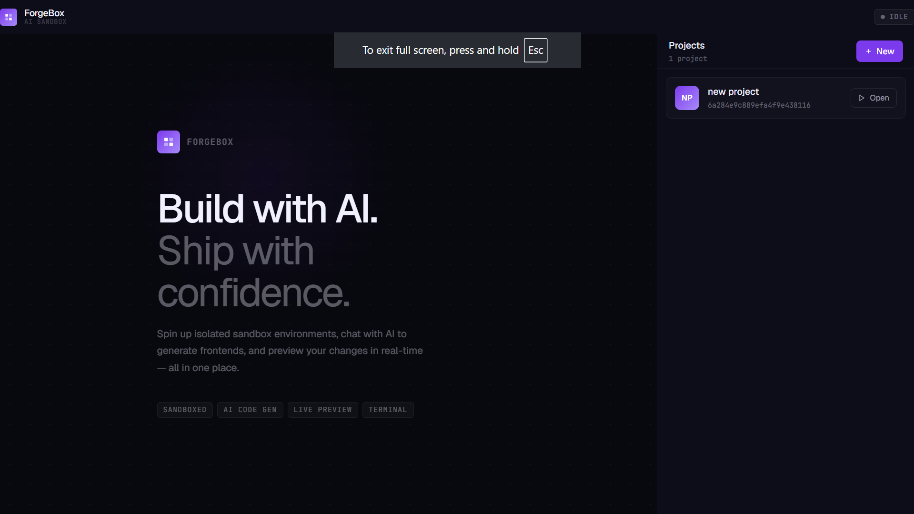

<br/>

[](https://kubernetes.io)
[](https://docker.com)
[](https://nodejs.org)
[](https://mongodb.com)
[](https://redis.io)
[](https://react.dev)
[](https://aws.amazon.com/eks)
[](https://socket.io)

<br/>

> 💡 Think **StackBlitz** meets **Kubernetes** — but self-hosted, AI-native, and built from scratch.

</div>

---

## 🧠 What is ForgeBox AI?

ForgeBox AI is a cloud-native, AI-powered frontend development platform. A developer describes what they want in natural language. The integrated AI agent reads the project's existing files, plans the changes, writes the source files, and the running Vite server inside the sandbox reflects those changes **immediately** — no manual build steps, no context switching.

Every user gets their own **disposable Kubernetes pod** — provisioned on demand, destroyed after idle timeout, with files persisted to AWS S3 so nothing is ever lost.

---

## 🎯 The Problem It Solves

| Traditional Cloud IDEs | ForgeBox AI |
|---|---|
| Persistent VMs — expensive & slow | Ephemeral pods — fast, cheap, always clean |
| AI generates code in isolation | AI writes files directly into the live sandbox |
| Manual build steps after AI suggestions | Vite HMR reflects changes instantly |
| Shared resources between users | Full isolation — one pod per user session |

---

## ✨ Features

<table>
<tr>
<td width="50%">

**🤖 AI Code Generation**  
Natural language → Mistral agent via LangChain → file writes → live HMR preview. Streams every tool call via SSE in real time.

**📦 Isolated Sandbox Pods**  
One Kubernetes pod per user session. Always clean. Init container seeds a fresh Vite template on every start.

**🌐 Live Browser Preview**  
Vite dev server proxied via wildcard subdomain routing. Every sandbox gets its own `<id>.preview.localhost` URL.

**💻 In-Browser Terminal**  
Real bash shell via node-pty + xterm.js over WebSocket. Install packages, run scripts — all from the browser.

</td>
<td width="50%">

**📁 File Explorer**  
Real-time `/workspace` directory listing from agent API. Excludes `node_modules`, `.git`, `dist`.

**💾 S3 File Persistence**  
chokidar watches workspace changes. Every write uploads to S3. Pod restart = files restored automatically.

**⏱️ Auto Sandbox Cleanup**  
Redis TTL + keyspace expiry events. Idle sandboxes deleted automatically — zero manual intervention.

**🔐 Google OAuth + JWT**  
Passport.js OAuth 2.0 flow. Login confirmation emails via RabbitMQ + Nodemailer.

</td>
</tr>
</table>

---

## 🖥️ Demo

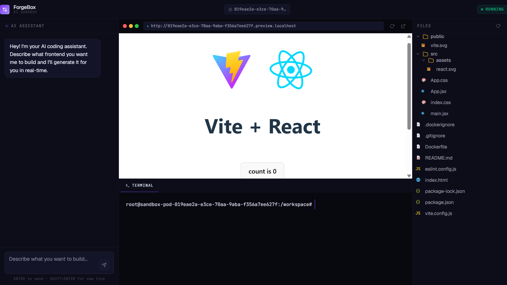
*Full IDE layout — AI chat (left) · Live Vite preview (center) · In-browser terminal · File explorer (right)*

<br/>

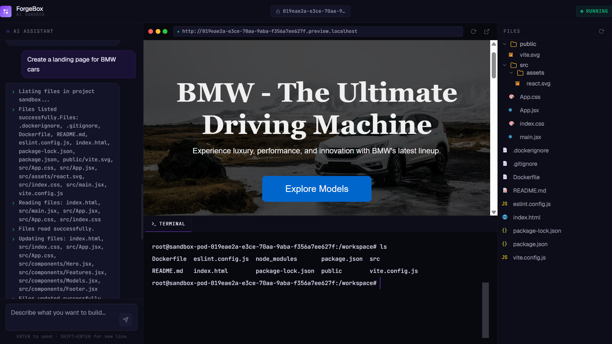
*AI agent generating a full React page from a natural language prompt — live in the preview iframe*

<br/>

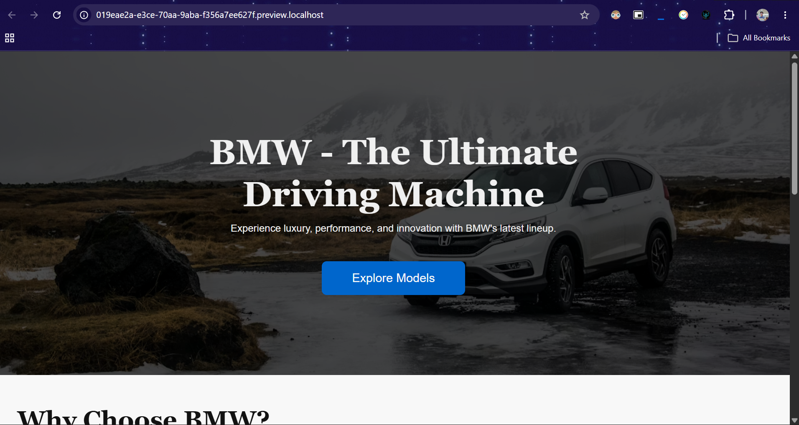
*Landing page scaffold generated by the AI agent, reflected instantly via Vite HMR*

---

## 🏗️ Architecture

### Main System Architecture

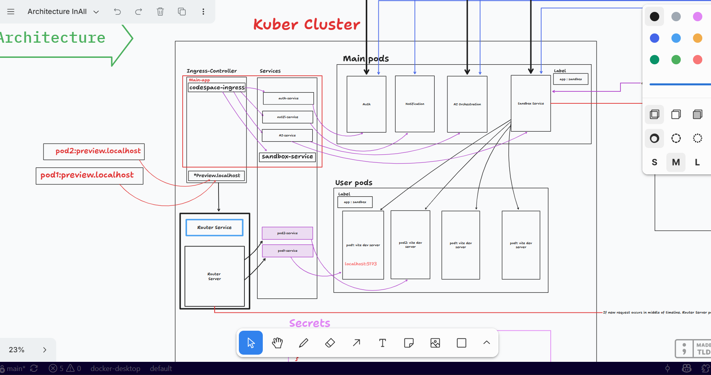

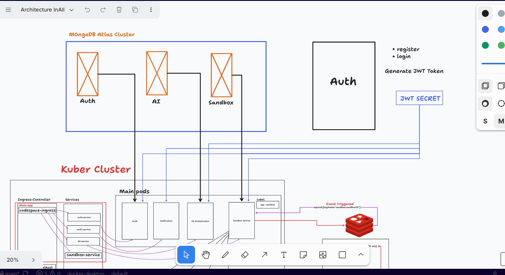

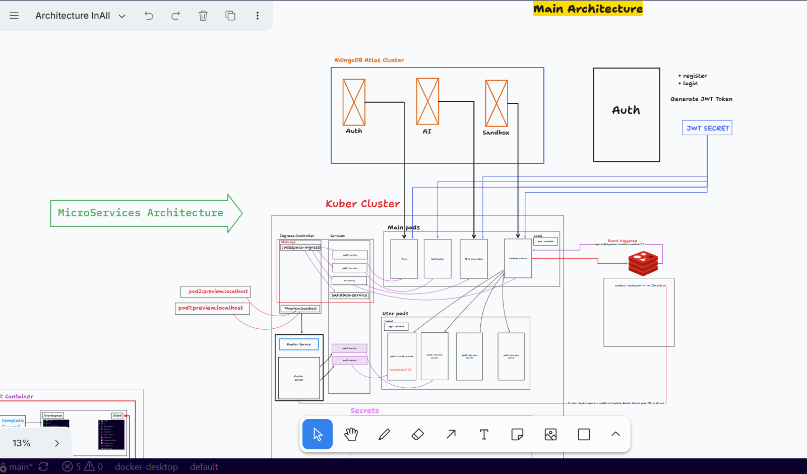

### Two-Tier Pod System

**Main Pods** — long-lived platform services:

| Service | Responsibility |
|---|---|
| `auth-service` | Google OAuth 2.0 flow, JWT issuance, user persistence |
| `notification-service` | RabbitMQ consumer → Nodemailer email via Gmail OAuth2 |
| `ai-orchestration` | LangChain + Mistral Medium agent, SSE streaming |
| `sandbox-server` | Kubernetes Pod/Service lifecycle, project CRUD, Redis TTL |
| `router-service` | Dynamic wildcard reverse proxy for sandbox subdomains |

**User Pods** — ephemeral, one per active sandbox:

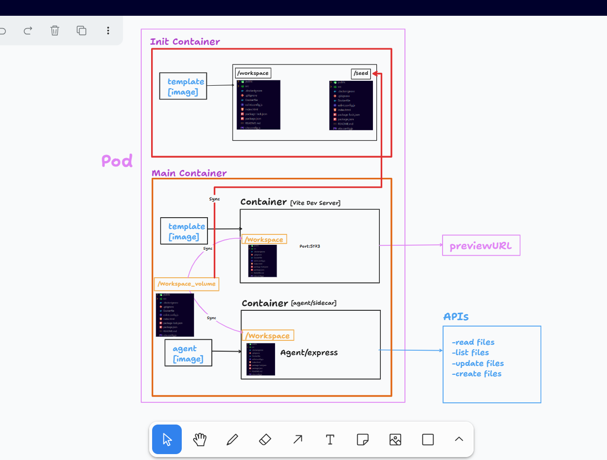

| Container | Role |
|---|---|
| `init-container` | Seeds Vite template scaffold into shared `/workspace` emptyDir volume |
| `vite-container` | Vite dev server on port 5173, HMR fires on every file change |
| `agent-container` | Express + Socket.IO sidecar — file REST API + WebSocket terminal (node-pty) |
| `sync-agent` | chokidar watcher → S3 uploads, restores files from S3 on startup |

### Request Flow

```
Browser
  └── NGINX Ingress Controller
        ├── /api/auth          → auth-service
        ├── /api/sandbox       → sandbox-server
        ├── /api/ai            → ai-orchestration-service
        └── *.preview.localhost → router-service
                                   ├── sandbox-service-<id>:80    (Vite preview)
                                   └── sandbox-service-<id>:3000  (Agent / Terminal)
```

> 💡 The AI service calls agent containers directly via internal cluster DNS — bypassing Ingress entirely for lower latency.

### Sandbox Lifecycle

```
User opens project → POST /api/sandbox/start
  → Pod created (init + vite + agent + sync-agent)
  → Service created (ports 80 + 3000)
  → Redis key created with 20-min TTL
    → Router refreshes TTL on every request
      → TTL expires (idle sandbox)
        → Redis keyspace event fires
          → sandbox-server auto-deletes Pod + Service ✓
```

### AI Agent Flow

```
User types prompt → POST /api/ai/invoke
  → LangChain + Mistral agent loop:
      1. list_files   — understand project structure
      2. read_files   — inspect current source
      3. update_files — write new components, CSS, configs
  → Each step streams to browser via SSE in real time
  → Vite HMR detects changes → preview refreshes instantly
  → sync-agent uploads modified files to S3
```

---

## 🛠️ Tech Stack

| Layer | Technology |
|---|---|
| **Orchestration** | Kubernetes (EKS target), eksctl, Skaffold |
| **Containerization** | Docker |
| **AI Agent** | LangChain, Mistral Medium (Mistral AI API) |
| **Backend** | Node.js, Express.js |
| **Real-time (AI)** | Server-Sent Events (SSE) |
| **Real-time (Terminal)** | Socket.IO WebSockets + node-pty |
| **Terminal UI** | xterm.js + FitAddon + WebLinksAddon |
| **Frontend** | React, Vite |
| **Database** | MongoDB Atlas |
| **Cache / Lifecycle** | Redis (keyspace notifications) |
| **Message Queue** | RabbitMQ |
| **File Storage** | AWS S3 + chokidar |
| **Auth** | Passport.js, Google OAuth 2.0, JWT |
| **Email** | Nodemailer + Gmail OAuth2 |
| **Ingress** | NGINX Ingress Controller |

---

## 📁 Project Structure

```
ForgeBox-AI/
│
├── 📁 assets/                    # Architecture diagrams + screenshots
│
├── 📁 auth/                      # Google OAuth + JWT service
│
├── 📁 frontend/                  # React + Vite IDE UI
│
├── 📁 k8s/                       # All Kubernetes manifests
│   ├── ai-deployment.yml
│   ├── ai-service.yml
│   ├── auth-deployment.yml
│   ├── auth-service.yml
│   ├── ingress.yml
│   ├── notification-deployment.yml
│   ├── notification-service.yml
│   ├── rbac.yml
│   ├── router-deployment.yml
│   ├── router-service.yml
│   ├── sandbox-deployment.yml
│   ├── sandbox-service.yml
│   └── secrets.yml
│
├── 📁 notification/              # RabbitMQ consumer + Nodemailer
│
├── 📁 orchestration_ai/          # LangChain + Mistral agent
│
├── 📁 sandbox/                   # Core sandbox services
│   ├── 📁 agent/                 # Express + Socket.IO sidecar + node-pty
│   ├── 📁 router/                # Dynamic wildcard reverse proxy
│   ├── 📁 server/                # Pod lifecycle manager + Redis TTL
│   ├── 📁 sync-agent/            # chokidar → S3 file sync
│   └── 📁 template/              # Vite template image (init container)
│
├── skaffold.yaml                 # Local dev iteration config
└── flow.tldr                     # System flow documentation
```

---

## 🚀 Local Setup

### Prerequisites
- Docker Desktop with Kubernetes enabled
- `kubectl` and `skaffold` installed
- MongoDB Atlas cluster, Redis instance, AWS S3 bucket
- Mistral AI API key + Google OAuth 2.0 credentials

### 1. Enable Kubernetes
```
Docker Desktop → Settings → Kubernetes → Enable Kubernetes → Apply & Restart
```
```bash
kubectl get nodes
# NAME             STATUS   ROLES
# docker-desktop   Ready    control-plane
```

### 2. Configure Secrets
```bash
# Edit k8s/secrets.yml with your values:
# MongoDB URI, Redis URL, JWT secret,
# Google OAuth credentials, Mistral API key, AWS credentials
```

### 3. Run
```bash
skaffold dev
```

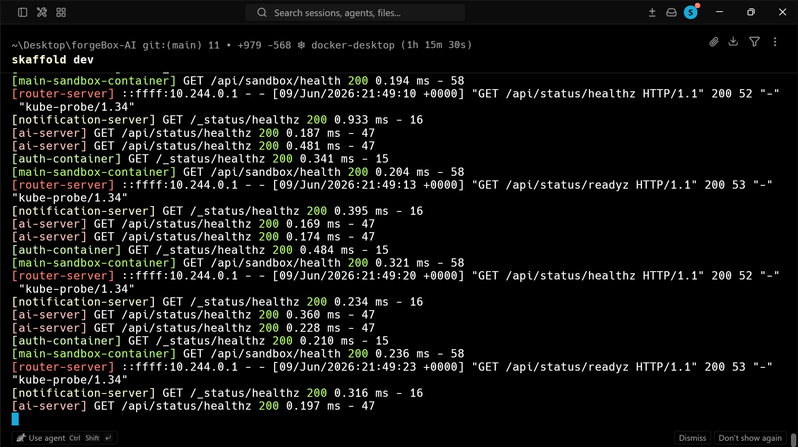
*Skaffold building images, applying manifests, and watching for file changes*

### 4. Access
```
http://localhost                         → Frontend
http://<sandboxId>.preview.localhost    → Sandbox live preview
http://<sandboxId>.agent.localhost      → Agent / terminal
```

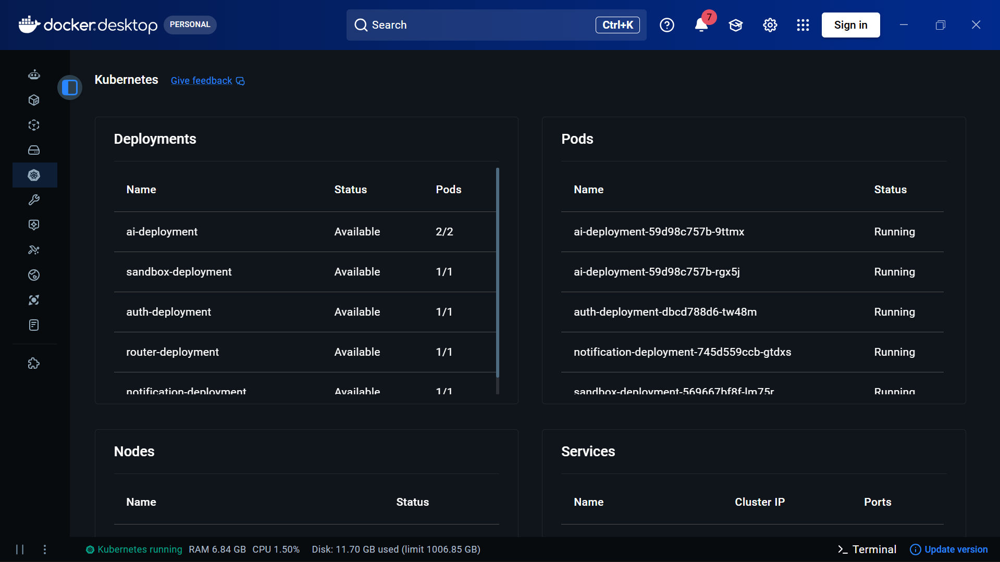
*Main service pods + dynamically provisioned user sandbox pods*

---

## ☸️ Kubernetes Manifests (EKS)

```bash
# Provision cluster
eksctl create cluster \
  --name forgebox \
  --region ap-south-1 \
  --nodegroup-name express-nodes \
  --node-type t3.medium \
  --nodes 2 --nodes-min 1 --nodes-max 3 \
  --managed

# Deploy all services
kubectl apply -f k8s/
kubectl get pods
```

---

## 🗄️ File Persistence — AWS S3

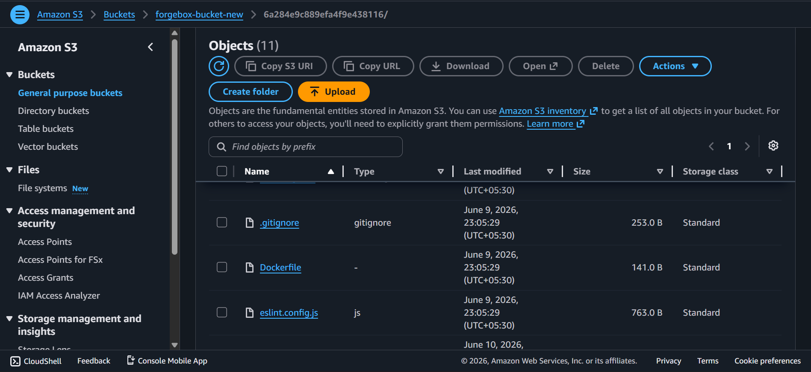
*S3 bucket — workspaces organized by project ID prefix, persisted across pod restarts*

---

## ⚠️ Deployment Status

> **Local Kubernetes:** ✅ Fully operational on Docker Desktop  
> **AWS EKS:** ⏳ Pending account verification

This project **requires real Kubernetes** — dynamic pod provisioning, wildcard ingress routing, and init container workspace seeding cannot run on any PaaS. EKS was the target. Here's what I debugged over a full day:

**❌ Attempt 1 — AWS Educate account**  
IAM correct. vCPU quota showed 8. CloudFormation deployed. Managed nodegroup nodes never launched — zero EC2 instances, silent failure. Educate accounts block EKS managed nodegroups at platform level. Not documented anywhere.

**❌ Attempt 2 — New personal account**  
Same timeout with 16 vCPU quota confirmed, correct IAM, t3.medium available across all 3 AZs in ap-south-1 and ap-south-2. Root cause: new AWS accounts have a silent 24-48hr EC2 verification period.

**❌ Attempt 3 — RBI e-mandate + Bank of Baroda**  
AWS bills in USD. RBI mandates explicit OTP e-mandate for international charges. BOB debit card dropped the authorization before the handshake completed.

> Kubernetes manifests are production-ready. EKS deployment goes live once account verification completes. Everything that could be validated locally has been validated.

---

## 🔑 Key Design Decisions

| Decision | Rationale |
|---|---|
| Ephemeral pods per user | Clean environments every session. Enables spot/preemptible nodes. |
| Init container for workspace | Immutable starting point. Template updated independently. |
| Redis TTL for lifecycle | No batch jobs. Delegates to Redis keyspace notifications. |
| SSE for AI streaming | Simpler than WebSockets for unidirectional streaming. |
| Socket.IO for terminal | Full-duplex required for interactive PTY. |
| AI via internal cluster DNS | Bypasses Ingress — faster file read/write for agent loop. |
| S3 for file persistence | Decouples user work from compute lifecycle. |
| RabbitMQ for notifications | Email failures isolated from auth critical path. |

---

<div align="center">

**Built by [Dev Srivastava]**  

[](https://linkedin.com/in/md-ved/)
[](https://github.com/MD-5-5)

</div>
